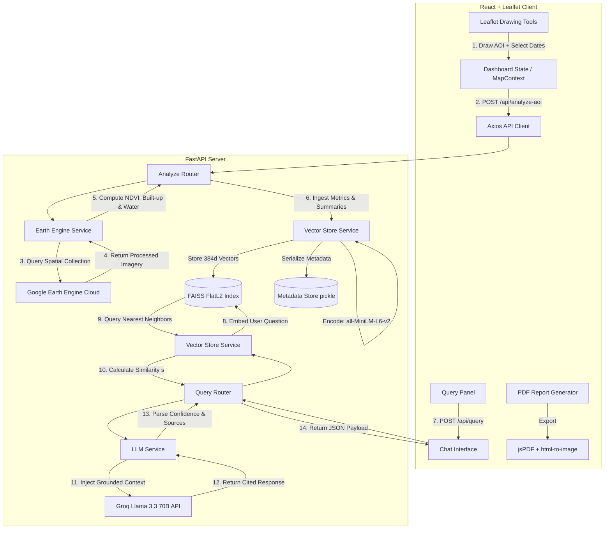

# GeoQuery AI - Geospatial Intelligence Platform 🌍🛰️🤖

**Ask questions about any location on Earth using satellite imagery, Google Earth Engine processing, and AI-powered semantic search!**

GeoQuery AI is a state-of-the-art geospatial intelligence platform that empowers researchers, urban planners, environmentalists, and educators to draw custom regions of interest (AOIs) on a map, extract ecological and urban metrics over time, and ask natural language questions about their environment. The system answers questions using a secure, fact-grounded Retrieval-Augmented Generation (RAG) pipeline to guarantee 100% data-grounded explainability with zero hallucinations.

⚡ **Powered by Google Earth Engine • FastAPI • Vector Search (FAISS) • Groq Llama 3.3 • React & Leaflet** ⚡

---

## 📖 Table of Contents
1. [🎯 Core Value Proposition](#-core-value-proposition)
2. [🏫 Science & Key Concepts for Beginners](#-science--key-concepts-for-beginners)
3. [🏗️ Detailed System Architecture](#%EF%B8%8F-detailed-system-architecture)
4. [🧮 Algorithms, Mathematical Formulas & Datasets](#-algorithms-mathematical-formulas--datasets)
5. [🖥️ Technical Deep Dive: Backend Services](#%EF%B8%8F-technical-deep-dive-backend-services)
6. [🎨 Technical Deep Dive: Frontend Interface](#-technical-deep-dive-frontend-interface)
7. [📝 Complete API Documentation](#-complete-api-documentation)
8. [🚀 Step-by-Step Installation Guide](#-step-by-step-installation-guide)
9. [🐛 Comprehensive Troubleshooting](#-comprehensive-troubleshooting)
10. [🔒 Privacy, Security & Best Practices](#-privacy-security--best-practices)
11. [💼 Real-World Use Cases](#-real-world-use-cases)

---

## 🎯 Core Value Proposition

Geospatial data analysis has historically required high-performance computing, complex GIS software (like ArcGIS or QGIS), and expert-level programming skills in remote sensing. GeoQuery AI solves this problem by introducing **Geospatial Natural Language Processing (Geo-NLP)**:

*   **Democratizing Earth Observation**: Anyone can draw a bounding box or custom polygon over any location—whether it's the Amazon rainforest, a growing city, or a drying lake—and immediately receive physical metrics.
*   **Conversational Spatial Context**: Instead of navigating complex databases, users simply query the system: *"Compare the vegetation health across our analyzed sites"* or *"How urbanized is this region compared to others?"*.
*   **Strict Factuality (Explainability-First)**: Standard generative AI models hallucinate geography. GeoQuery AI's RAG pipeline operates under a strict "closed-book" policy, using **only** satellite-derived, peer-reviewed indices from the vector store to formulate answers, citing exact coordinate matches, date ranges, and confidence levels.

---

## 🏫 Science & Key Concepts for Beginners

If you are new to Remote Sensing or AI pipelines, here is a quick guide to the core concepts used in this project:

### 1. Remote Sensing & Imagery Bands
Satellites like **Sentinel-2** don't just capture normal photos (Red, Green, Blue). They capture light in many different "bands" across the electromagnetic spectrum, including **Near-Infrared (NIR)** and **Shortwave-Infrared (SWIR)**.
*   **Why does this matter?** Healthy plants reflect Near-Infrared light strongly due to the structure of their cell walls, but absorb Red light to perform photosynthesis. By comparing these light bands, we can calculate how healthy, dense, or dry the vegetation is.

### 2. Retrieval-Augmented Generation (RAG)
Large Language Models (LLMs) like Llama 3.3 are smart but do not know real-time satellite metrics for a specific coordinate. 
*   **Our Solution**: 
    1. We convert satellite readings into raw numbers.
    2. We turn those numbers into written descriptive summaries (e.g., *"The selected area shows 65.4% vegetation coverage"*).
    3. We convert these text summaries into 384-dimensional mathematical arrays called **Embeddings** using a neural network.
    4. When you ask a question, we find the closest matching summaries in our **FAISS Vector Database** using L2 similarity, feed only these matching facts into the LLM, and prompt it to write a readable, cited answer.

### 3. Google Earth Engine (GEE)
GEE is a cloud platform for planetary-scale environmental data analysis. Instead of downloading gigabytes of satellite images to your computer, we send our polygon coordinates to Google's cloud server. Google processes the images in seconds and sends back the mathematical summaries.

---

## 🏗️ Detailed System Architecture

GeoQuery AI is built using a decoupled client-server architecture with a fast API layer and a dedicated AI/ML pipeline.

### System Data Flow

The flow below visualizes the complete two-phase pipeline: **Ingestion (Area Analysis)** and **Retrieval & Inference (User Query)**.



---

## 🧮 Algorithms, Mathematical Formulas & Datasets

To ensure maximum precision, we utilize industry-standard remote sensing datasets and peer-reviewed formulas. Below are the details of how every single calculation is performed.

### 1. Vegetation Index: NDVI (Normalized Difference Vegetation Index)
*   **Sensor/Dataset**: `COPERNICUS/S2_SR` (Sentinel-2 MSI Level-2A Bottom-of-Atmosphere Reflectance).
*   **Wavelength Science**: Green vegetation absorbs solar radiation in the photo-synthetically active radiation spectral region (Red band) and reflects strongly in the near-infrared (NIR band). 
*   **Formula**:
    $$\text{NDVI} = \frac{\text{NIR} - \text{Red}}{\text{NIR} + \text{Red}} = \frac{\text{Band 8} - \text{Band 4}}{\text{Band 8} + \text{Band 4}}$$
    *   **Band 8 (NIR)**: center wavelength $842\text{ nm}$ (10-meter spatial resolution).
    *   **Band 4 (Red)**: center wavelength $665\text{ nm}$ (10-meter spatial resolution).
*   **Ecology Classifications**:
    *   $$\text{NDVI} > 0.6$$: Dense vegetation canopy (e.g., dense tropical forests, old-growth forests).
    *   $$0.2 < \text{NDVI} \le 0.6$$: Moderate vegetation (e.g., grasslands, shrublands, agricultural crops).
    *   $$\text{NDVI} \le 0.2$$: Sparse vegetation or completely bare soil, rock, sand, concrete, or water bodies.

### 2. Water Proxy Index: NDWI (Normalized Difference Water Index)
*   **Sensor/Dataset**: `COPERNICUS/S2_SR` (Sentinel-2 MSI).
*   **Wavelength Science**: Water bodies reflect green light but absorb Near-Infrared wavelengths almost entirely. NDWI values are highly positive for water features and negative or zero for soil and vegetation.
*   **Formula**:
    $$\text{NDWI} = \frac{\text{Green} - \text{NIR}}{\text{Green} + \text{NIR}} = \frac{\text{Band 3} - \text{Band 8}}{\text{Band 3} + \text{Band 8}}$$
    *   **Band 3 (Green)**: center wavelength $560\text{ nm}$ (10-meter spatial resolution).
    *   **Band 8 (NIR)**: center wavelength $842\text{ nm}$ (10-meter spatial resolution).
*   **Percentage Proxy**: The monthly time-series uses NDWI as a fast water proxy by tracking the percentage of pixels satisfying $\text{NDWI} > 0$.

### 3. Built-up Area Percentage (Human Settlements)
*   **Dataset**: `JRC/GHSL/P2023A/GHS_BUILT_S/2020` (Joint Research Centre Global Human Settlement Layer).
*   **Spatial Resolution**: 100 meters.
*   **Science**: Quantifies the presence of human-built structures (buildings, roads, concrete) derived from multi-temporal Landsat and Sentinel-2 data.
*   **Methodology**:
    *   We load the GHSL built-up grid layer.
    *   Apply a logical threshold to extract built-up surface pixels:
        $$\text{Built-up Mask} = \text{Pixel Value} > 0$$
    *   Reduce the region over the user's selected polygon using `ee.Reducer.mean()` to compute the fraction of pixels classified as built-up.
    *   Multiply the fraction by 100 to yield a clean percentage ($0.0\%$ to $100.0\%$).

### 4. Water Coverage Percentage (Global Surface Water)
*   **Dataset**: `JRC/GSW1_4/GlobalSurfaceWater` (Joint Research Centre Global Surface Water Mapping Layers v1.4).
*   **Spatial Resolution**: 30 meters.
*   **Science**: Tracks the occurrence, recurrence, change, and seasonality of surface water bodies globally over a multi-decade time series.
*   **Methodology**:
    *   We extract the `occurrence` band which represents the frequency with which water was present on the surface from 1984 to 2021.
    *   Apply an occurrence threshold to classify permanent and seasonal water bodies:
        $$\text{Water Mask} = \text{occurrence} > 50$$
        *(i.e., pixels that were covered in liquid water for more than 50% of the historical observation timeline)*
    *   Perform a spatial mean reducer over the geometry to calculate the total water surface area percentage.

### 5. Vector Distance to Similarity Normalization
*   **Similarity Metric**: L2 Euclidean Distance.
*   **Math**: FAISS (Facebook AI Similarity Search) calculates the squared L2 Euclidean distance $d$ between the 384-dimensional query embedding vector $q$ and target database embedding vectors $e$:
    $$d = \sum_{j=1}^{384} (q_j - e_j)^2$$
*   **Conversion to Similarity Score ($s$)**: Euclidean distance operates on an infinite scale $[0, \infty)$ where smaller is better. To convert this into a clear, normalized percentage score $s \in [0, 1]$ representing a matching score, we use the following equation:
    $$s = \frac{1}{1 + d}$$
    *   If $d = 0$ (perfect match), then $s = \frac{1}{1} = 1.0$ ($100\%$ match).
    *   As $d \to \infty$, $s \to 0$ ($0\%$ match).
    *   We establish a strict similarity cutoff at $$s \ge 0.3$$; any retrieved context scoring below this is rejected as irrelevant.

### 6. AI Confidence Level Derivation
To protect users from low-quality retrievals, we calculate a confidence score based on the arithmetic mean of retrieved similarity scores:
$$\bar{s} = \frac{1}{K} \sum_{i=1}^{K} s_i$$
*   **High Confidence**: $$\bar{s} > 0.7$$ (Retrieved contexts match the user's query topic perfectly).
*   **Medium Confidence**: $$0.5 < \bar{s} \le 0.7$$ (Grounded matching data is present but partially scattered).
*   **Low Confidence**: $$\bar{s} \le 0.5$$ (Limited matching data exists; the LLM will warn the user about data sparsity).

---

## 🖥️ Technical Deep Dive: Backend Services

The backend is built with **FastAPI (ASGI)** for asynchronous high-performance routing. The codebase is broken down into three specialized services:

### 1. `EarthEngineService` (`backend/services/earth_engine.py`)
This service acts as the bridge to Google Earth Engine's Python API.
*   **Fallback Mock Engine**: If GEE is not authenticated, the service automatically switches to `mock_mode = True`. It leverages Python's `random` package to synthesize mathematically coherent data (e.g., higher vegetation in summer months, consistent coordinate ranges) so that the entire pipeline can be tested locally without internet/GEE tokens.
*   **Geometry Conversion**: Converts standard GeoJSON coordinate structures (from Leaflet) into Earth Engine geometry equivalents (`ee.Geometry.Polygon`, `ee.Geometry.Point`, etc.).
*   **Boundary Enforcement**: Validates Area of Interest (AOI) to prevent server overload:
    $$0.01 \text{ km}^2 \le \text{AOI Area} \le 10,000 \text{ km}^2$$
*   **Regional Reducers**: Implements multi-reducer combinations to fetch the mean, min, and max values in a single high-performance network trip:
    ```python
    mean_ndvi.reduceRegion(
        reducer=ee.Reducer.mean().combine(
            reducer2=ee.Reducer.minMax(),
            sharedInputs=True
        ),
        geometry=aoi,
        scale=10
    )
    ```

### 2. `VectorStoreService` (`backend/services/vector_store.py`)
Provides semantic search capabilities by wrapping the **FAISS** CPU library.
*   **Text Embedding**: Uses Hugging Face's `sentence-transformers/all-MiniLM-L6-v2` to process summaries. This model is exceptionally fast, lightweight (90MB), and produces 384-dimensional dense vectors.
*   **Persistence Strategy**: Since FAISS is purely in-memory, we save the index file (`index.faiss`) to disk using FAISS's C++ bindings. We store the rich metadata (original GeoJSON coordinates, metrics, date ranges) separately by serializing the index positions in a Python `.pkl` dictionary file via `pickle`.
*   **Index Deletion Sync**: Because standard FAISS Flat indexes do not support easy in-place element deletions, the service implements a synchronized metadata cleanup. When a user requests to delete an AOI, it deletes it from the metadata mapping; subsequent semantic queries filtering out unmapped IDs bypass the removed AOI.

### 3. `LLMService` (`backend/services/llm_service.py`)
Coordinates retrieval prompts and handles inference.
*   **Fast Inference**: Integrated with the **Groq API** to access **Llama 3.3 70B Versatile** yielding sub-500ms responses.
*   **Anti-Hallucination Guardrails**: Employs a system prompt designed with strict structural bounds:
    ```text
    CRITICAL RULES:
    1. Answer ONLY using the provided satellite data summaries.
    2. Do NOT make predictions, assumptions, or extrapolations.
    3. If the data doesn't contain the answer, clearly state that.
    4. Always cite which source(s) you used (e.g., "According to Source 1...").
    ```
*   **Fact-Grounded Validation**: Inspects responses for safety keywords ("no data", "insufficient") if the vector database yielded no matching spatial records.

---

## 🎨 Technical Deep Dive: Frontend Interface

The frontend is an ultra-premium Single Page Application built on **React 18** and **Vite** and styled with **Tailwind CSS**.

### 1. Unified State Context (`frontend/src/context/MapContext.jsx`)
To avoid prop-drilling, the frontend leverages a unified `MapContext` wrapping `localStorage` persistence:
*   **Persistence**: Automatically saves the user's active `selectedAOI` and computed `analysisResults` to the browser's local storage. On page reload, the state is rehydrated instantly, ensuring a seamless user experience.
*   **Comparison Engine State**: Manages states for two independent areas simultaneously (`selectedAOI` and `secondaryAOI`), along with their separate computed satellite data structures (`analysisResults` and `secondaryAnalysisResults`).

### 2. Mapping Engine (`frontend/src/components/MapView.jsx`)
Integrates the standard Leaflet map with professional-grade drawing extensions:
*   **Geoman Free Controls (`@geoman-io/leaflet-geoman-free`)**: Mounted directly inside the Leaflet container to manage advanced drawing triggers.
*   **Single Area Enforcement**: Listens to the `pm:create` event. When a user finishes drawing a new shape, the code loops through the active layers and removes any older custom overlays, ensuring that the interface is never cluttered and only the active target is analyzed.
*   **Real-time Editing Hooks**: Listens to `pm:edit` events. If the user drags a vertex to modify a polygon on-screen, the code intercepts the event, extracts the modified GeoJSON coordinates, and updates `MapContext` on the fly.

### 3. Location Geocoding (`frontend/src/components/SearchControl.jsx`)
A custom searching overlay mounted over the map.
*   **OpenStreetMap Nominatim API Integration**: Connects to the public geocoding service via Axios.
*   **Fly-to Animation**: Selecting a search suggestion grabs the returned latitude and longitude and triggers Leaflet's premium smooth panning animation:
    ```javascript
    map.flyTo([lat, lon], 13);
    ```

### 4. Interactive Historical Charting (`frontend/src/components/TimeSeriesChart.jsx`)
Built on top of **Recharts** to present months of satellite history.
*   **Visual Styling**: Uses smooth linear gradients for vegetation fills and shifts border colors dynamically depending on whether it's rendered inside the dark-themed sidebar or the light-themed exportable PDF report.
*   **Axis Formatter**: Parses date strings (`YYYY-MM`) and uses a custom tick formatter to render clean 2-digit month indices, preventing overlap on narrow viewports.

### 5. Report Generation & Exports (`frontend/src/components/AnalysisReport.jsx`)
Allows users to export their spatial insights as professional reports.
*   **Off-Screen Capture Technique**: The `<AnalysisReport>` component renders a complete A4-sized template page. The component is kept hidden from standard viewports (`hidden` CSS class). 
*   **High-Res Capture**: Clicking the "PDF" button briefly removes the `hidden` class, uses `html-to-image` (`toPng`) to generate a high-fidelity $2\times$ pixel ratio PNG of the report canvas (containing comparison tables, active date ranges, and charts), prints it onto a `jsPDF` standard A4 canvas page, saves the file, and re-hides the component—all in under 2 seconds.

---

## 📝 Complete API Documentation

GeoQuery AI exposes standardized JSON endpoints. You can interact with these endpoints programmatically or read their structure below.

### 1. AOI Analysis Endpoint
**`POST /api/analyze-aoi`**
Analyze spatial coordinates and save metrics to the vector store.

*   **Request Headers**: `Content-Type: application/json`
*   **Request Payload**:
    ```json
    {
      "geometry": {
        "type": "Polygon",
        "coordinates": [
          [
            [71.1, 22.1],
            [72.2, 22.1],
            [72.2, 23.2],
            [71.1, 23.2],
            [71.1, 22.1]
          ]
        ]
      },
      "start_date": "2023-01-01",
      "end_date": "2023-12-31"
    }
    ```
*   **Response Payload (`200 OK`)**:
    ```json
    {
      "aoi_id": "8bcf6274-124b-4b13-9a3d-3dfb768e1ab1",
      "coordinates": {
        "type": "Polygon",
        "coordinates": [[[71.1, 22.1], [72.2, 22.1], [72.2, 23.2], [71.1, 23.2], [71.1, 22.1]]]
      },
      "date_range": {
        "start": "2023-01-01",
        "end": "2023-12-31"
      },
      "metrics": {
        "ndvi": {
          "mean": 0.456,
          "min": 0.21,
          "max": 0.73,
          "trend": "increasing"
        },
        "built_up_pct": 12.4,
        "water_coverage_pct": 2.1
      },
      "summaries": [
        "The selected area shows 45.6% vegetation coverage (moderate vegetation) with an increasing trend.",
        "Built-up area accounts for 12.4% of the region.",
        "No significant water bodies detected in this area."
      ],
      "time_series_data": [
        { "date": "2023-01", "ndvi": 0.42, "water": 1.9 },
        { "date": "2023-02", "ndvi": 0.45, "water": 2.1 }
      ],
      "timestamp": "2026-05-26T10:42:00.123456"
    }
    ```

### 2. Conversational RAG Query Endpoint
**`POST /api/query`**
Ask natural language questions about previously analyzed areas.

*   **Request Payload**:
    ```json
    {
      "question": "What is the vegetation coverage in the analyzed areas?",
      "aoi_id": null,
      "top_k": 5
    }
    ```
    *Set `aoi_id` to a string UUID to limit the search scope to that single location, or leave it `null` to search across all locations.*
*   **Response Payload (`200 OK`)**:
    ```json
    {
      "question": "What is the vegetation coverage in the analyzed areas?",
      "answer": "According to Source 1, the analyzed region shows 45.6% vegetation coverage, which represents moderate vegetation such as grasslands and crops. The vegetation exhibits an increasing trend over the selected time range.",
      "sources": [
        {
          "aoi_id": "8bcf6274-124b-4b13-9a3d-3dfb768e1ab1",
          "similarity": 0.852,
          "date_range": {
            "start": "2023-01-01",
            "end": "2023-12-31"
          }
        }
      ],
      "confidence": "high",
      "context_count": 1,
      "timestamp": "2026-05-26T10:45:00.987654"
    }
    ```

### 3. System Status Endpoint
**`GET /health`**
Retrieves the real-time connectivity status of all backend connections.

*   **Response Payload (`200 OK`)**:
    ```json
    {
      "status": "healthy",
      "service": "GeoQuery AI API",
      "earth_engine_initialized": true,
      "vector_store_initialized": true,
      "llm_service_initialized": true
    }
    ```

---

## 🚀 Step-by-Step Installation Guide

Follow these steps to run both the FastAPI backend and the React frontend on your local system:

### Prerequisites
*   **Python**: Version 3.8 to 3.11 installed.
*   **Node.js**: Version 18 or newer installed (includes `npm`).
*   **Groq API Key**: Get a free API key [from the Groq Console](https://console.groq.com/).
*   **Google Earth Engine Account**: Request free access [here](https://earthengine.google.com/).

---

### Step 1: Clone the Repository
```bash
git clone https://github.com/yourusername/GeoQuery.ai.git
cd GeoQuery.ai
```

---

### Step 2: Set Up Backend Environment

1. Navigate to the `backend` directory:
   ```bash
   cd backend
   ```
2. Create a Python virtual environment:
   ```bash
   # Windows
   python -m venv venv
   venv\Scripts\activate

   # Linux/Mac
   python3 -m venv venv
   source venv/bin/activate
   ```
3. Install all backend dependencies:
   ```bash
   pip install -r requirements.txt
   ```
4. Authenticate your local Google Earth Engine environment (Only needed once):
   ```bash
   earthengine authenticate
   ```
   *This opens a browser tab. Log in with your Google account authorized for Earth Engine and copy the generated authorization code back into your terminal.*
5. Set up your local environment configuration. Create a file named `.env` in the `backend` folder:
   ```env
   # Groq AI Key (Required for RAG)
   GROQ_API_KEY=gsk_your_groq_api_key_goes_here

   # Server Settings
   HOST=0.0.0.0
   PORT=8000
   FRONTEND_URL=http://localhost:5173

   # Vector DB Settings
   FAISS_PERSIST_DIR=./faiss_db
   ```
6. Start the FastAPI development server:
   ```bash
   python main.py
   ```
   *The terminal will display logs showing that Google Earth Engine, FAISS, and Groq have initialized successfully. The backend is now listening at `http://localhost:8000`.*

---

### Step 3: Set Up Frontend Environment

1. Open a new terminal window and navigate to the `frontend` directory:
   ```bash
   cd frontend
   ```
2. Install all frontend node modules:
   ```bash
   npm install
   ```
3. Create a `.env` configuration file inside the `frontend` folder:
   ```env
   VITE_API_BASE_URL=http://localhost:8000
   ```
4. Start the frontend Vite hot-reload server:
   ```bash
   npm run dev
   ```
5. Click the link in the terminal (usually `http://localhost:5173`) to launch the application dashboard!

---

## 🐛 Comprehensive Troubleshooting

If you encounter issues during setup or run-time, check the solutions below:

### 1. Google Earth Engine Initialization Fails
*   **Symptoms**: Backend console prints `Failed to initialize Google Earth Engine: ...` and logs show `Falling back to MOCK MODE`.
*   **Root Cause**: Local OAuth credentials are missing, or your Google account hasn't been approved for GEE access yet.
*   **Solution**: 
    1. Run `earthengine authenticate` again and make sure the login completes successfully.
    2. Check if you can open the [GEE Code Editor](https://code.earthengine.google.com/) in your browser. If you get an access-denied message, sign up for free access.
    3. *Note: If you just want to test the UI and RAG query pipeline, you can safely ignore this error. The backend automatically switches to **Mock Mode**, generating realistic synthetic data.*

### 2. Groq API Connection Fails
*   **Symptoms**: Asking questions in the Query Panel returns a toast notification showing `Failed to process query`.
*   **Root Cause**: `GROQ_API_KEY` is missing from `backend/.env` or has expired.
*   **Solution**: Open `backend/.env`, ensure there are no spaces or quotes around your key, and verify that your key starts with `gsk_`. You can test your key's validity directly using curl:
    ```bash
    curl -X POST "https://api.groq.com/openai/v1/chat/completions" \
         -H "Authorization: Bearer YOUR_GROQ_API_KEY" \
         -H "Content-Type: application/json" \
         -d '{"model": "llama3-8b-8192", "messages": [{"role": "user", "content": "Hello"}]}'
    ```

### 3. FAISS Database Load Errors
*   **Symptoms**: Server crash on startup with errors like `pickle.UnpicklingError` or `index.faiss not found`.
*   **Root Cause**: The persisted metadata pickle file got corrupted or is out of sync with the FAISS index structure.
*   **Solution**: Stop your backend server, delete the entire folder `backend/faiss_db/`, and restart the server. The backend will automatically rebuild a clean, empty vector index.

### 4. CORS Errors in Frontend
*   **Symptoms**: Web console displays `Access-Control-Allow-Origin header is missing` and requests fail.
*   **Root Cause**: The backend's permitted CORS origins do not match the port the frontend is running on.
*   **Solution**: Check `backend/main.py`. Ensure that `allow_origins` includes your exact local port (e.g., `http://localhost:5173`). If you deployed the app, make sure `FRONTEND_URL` in your backend environment variables matches your Vercel URL exactly without a trailing slash.

---

## 🔒 Privacy, Security & Best Practices

To run a safe, enterprise-grade instance of GeoQuery AI, observe the following rules:

*   **API Key Protection**: Never commit your `backend/.env` or `frontend/.env` files to git. They are automatically added to `.gitignore`.
*   **Input Sanitization**: Pydantic's `@field_validator` validates all coordinate formats and bounds checks date objects. It ensures `end_date` is always chronologically after `start_date` and restricts search requests to $500$ characters maximum to avoid prompt-injection attacks.
*   **No Permanent Imagery Storage**: Satellite data is streamed to GEE, reduced to scalar metrics, and discarded immediately. No raw raster images are stored on our servers, saving disk space and protecting proprietary data.
*   **Vector Isolation**: The vector database stores only aggregate numeric metrics and short descriptive strings, ensuring no raw geospatial source geometries are exposed publicly.

---

## 💼 Real-World Use Cases

GeoQuery AI is optimized to deliver value across several domains:

*   🌲 **Environmental Monitoring**: Draw polygons over forests to analyze deforestation rates, inspect forest fire scars over a 12-month period, or monitor vegetation greening trends.
*   🏙️ **Urban Sprawl Studies**: Analyze urbanization speed in metropolitan suburbs by tracking the built-up area index derived from the GHSL dataset.
*   💧 **Reservoir & Lake Volume Monitoring**: Select bodies of water (such as Lake Mead, the Aral Sea, or local reservoirs) to view water coverage contraction or seasonal expansion trends over time.
*   🎓 **Geospatial & Academic Research**: Introduce beginners to satellite bands, remote sensing, and remote data computation without requiring complex software setups.

---

## 👥 Contributing

Contributions are what make the open-source community such an amazing place to learn, inspire, and create. Any contributions you make are **greatly appreciated**.

1. Fork the Project.
2. Create your Feature Branch (`git checkout -b feature/AmazingFeature`).
3. Commit your Changes (`git commit -m 'Add some AmazingFeature'`).
4. Push to the Branch (`git push origin feature/AmazingFeature`).
5. Open a Pull Request.

---

## 📜 License

Distributed under the MIT License. See `LICENSE` for more information.

---

### 🎉 Made with ❤️ by geospatial enthusiasts and environmental researchers. Explore the Earth! 🎉
