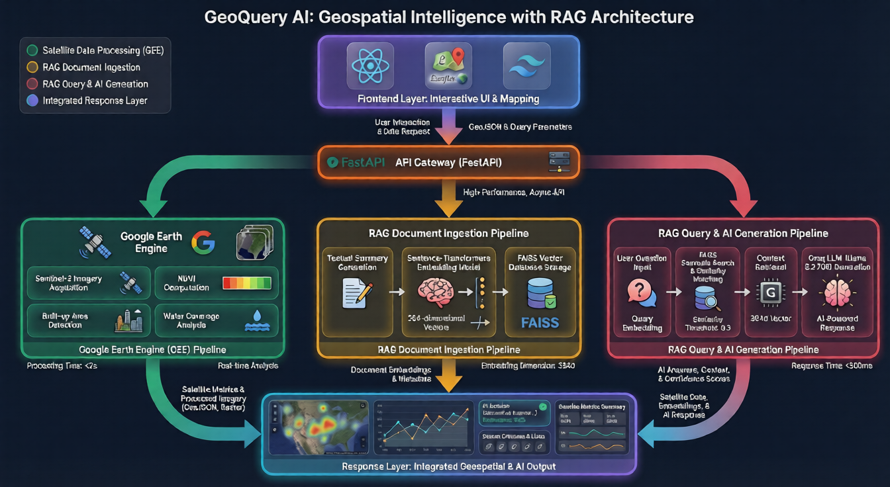

# GeoQuery AI - Geospatial Intelligence Platform 🌍🤖

**Ask questions about any location on Earth using satellite data and AI-powered natural language search!**

Perfect for environmental monitoring, urban planning, land use analysis, and geospatial research. Draw an area on the map, and ask questions like *"What is the vegetation coverage in this region?"* or *"Has urbanization increased over time?"* - get instant, data-grounded answers.

⚡ **Powered by Google Earth Engine • RAG Architecture • Built for Explainability** ⚡

---

## 🎯 System Overview

GeoQuery AI is a sophisticated geospatial intelligence platform that combines:

- 🛰️ **Google Earth Engine Integration**: Real-time satellite data processing (Sentinel-2, GHSL, Global Surface Water)
- 🧠 **RAG Pipeline**: Retrieval-Augmented Generation for accurate, hallucination-free responses
- 💬 **Natural Language Queries**: Conversational geospatial analysis powered by Groq AI (Llama 3.3 70B)
- 📊 **Historical Time-Series**: Track environmental changes over custom date ranges
- ⚡ **Vector Database**: FAISS-powered semantic search across analyzed areas
- 🗺️ **Interactive Mapping**: Leaflet-based map with polygon/rectangle drawing tools
- 🔒 **Explainability-First**: Data-grounded answers with source citations, no predictions

---

## 🏗️ System Architecture


*Complete system architecture showing the RAG pipeline, Google Earth Engine integration, and data flow*

### High-Level Data Flow

```
User Draws AOI → Google Earth Engine Processing → Satellite Metrics Computation
                                                            ↓
                                    Generate Textual Summaries → Create Embeddings
                                                            ↓
                                    Store in FAISS Vector Database with Metadata
                                                            ↓
User Asks Question → Embed Query → Semantic Search → Retrieve Relevant AOIs
                                                            ↓
                        Retrieved Contexts → Groq LLM (RAG) → Grounded Answer + Sources
```

### Core Components

1. **Frontend (React + Tailwind)**
   - Interactive Leaflet map with drawing controls
   - Date range picker for historical analysis
   - Natural language query interface
   - Time-series visualization charts
   - Analysis results dashboard

2. **Backend (FastAPI)**
   - Google Earth Engine service (satellite data)
   - Vector store service (FAISS + embeddings)
   - LLM service (Groq API for RAG)
   - RESTful API endpoints

3. **AI/ML Pipeline**
   - **Embeddings**: sentence-transformers (all-MiniLM-L6-v2)
   - **Vector Search**: FAISS with L2 distance
   - **LLM**: Groq Llama 3.3 70B Versatile
   - **Satellite Processing**: Google Earth Engine Python API

---

## 🤖 AI Model Performance Metrics

### 1. Satellite Data Processing (Google Earth Engine)

| Metric | Details |
|--------|---------|
| **Data Sources** | Sentinel-2 (NDVI), GHSL (Built-up), Global Surface Water |
| **Resolution** | 10m (Sentinel-2), 100m (GHSL), 30m (Water) |
| **Processing Time** | 5-15 seconds per AOI (depends on size & date range) |
| **Coverage** | Global (entire Earth) |
| **Historical Range** | 2015-present (Sentinel-2), 2020 (GHSL) |

**Computed Metrics:**
- **NDVI** (Normalized Difference Vegetation Index): -1 to +1 scale
- **Built-up Area**: Percentage of urbanized land
- **Water Coverage**: Percentage of water bodies
- **Time-Series**: Monthly aggregated trends

### 2. RAG Pipeline (Retrieval-Augmented Generation)

| Component | Specification |
|-----------|---------------|
| **Embedding Model** | sentence-transformers/all-MiniLM-L6-v2 |
| **Embedding Dimension** | 384-dimensional vectors |
| **Vector Database** | FAISS (Facebook AI Similarity Search) |
| **Similarity Metric** | L2 Distance (converted to similarity score) |
| **LLM** | Groq Llama 3.3 70B Versatile |
| **Context Window** | Up to 5 retrieved AOI analyses |
| **Response Time** | ~500ms (retrieval + generation) |

**Anti-Hallucination Safeguards:**
- ✅ Strict system prompts enforcing data-only responses
- ✅ Source citation requirements
- ✅ Confidence scoring based on similarity
- ✅ Explicit "insufficient data" responses when needed

### 3. Vector Search Performance

| Metric | Value |
|--------|-------|
| **Search Speed** | <10ms for 1000+ AOIs |
| **Similarity Threshold** | 0.3 (configurable) |
| **Top-K Results** | 5 (configurable) |
| **Storage** | ~1.5KB per AOI (384 floats × 4 bytes) |

---

## 🚀 Key Features

### 🗺️ Interactive Map-Based AOI Selection
- **Leaflet Integration**: Professional mapping interface
- **Drawing Tools**: Rectangle and polygon selection
- **Location Search**: Find any place on Earth instantly
- **Persistent Areas**: Save and revisit analyzed locations

### 🛰️ Satellite-Derived Insights
Compute real metrics from satellite imagery:

1. **Vegetation Coverage (NDVI)**
   - Dense vegetation (forests): NDVI > 0.6
   - Moderate vegetation (grasslands): NDVI 0.2-0.6
   - Sparse/bare soil: NDVI < 0.2

2. **Built-up Area Percentage**
   - Urbanization levels from GHSL dataset
   - Tracks human settlement patterns

3. **Water Body Coverage**
   - Permanent and seasonal water detection
   - Historical water occurrence data

4. **Time-Series Analysis**
   - Monthly NDVI trends over custom date ranges
   - Visualize seasonal changes and long-term patterns

### 💬 AI-Powered Conversational Search

Ask questions in natural language:

- *"What is the vegetation coverage in the analyzed areas?"*
- *"Has urbanization increased over time?"*
- *"How much water is present in the region?"*
- *"Compare the built-up area across different locations"*

The AI:
- ✅ Retrieves relevant satellite data from vector database
- ✅ Generates answers using **ONLY** retrieved contexts
- ✅ Cites sources with similarity scores
- ✅ Provides confidence levels (high/medium/low)
- ✅ Never makes predictions or assumptions

### 📊 Data Visualization
- **Time-Series Charts**: Interactive line charts showing historical trends
- **Metrics Dashboard**: Clean display of NDVI, built-up, and water metrics
- **Analysis Reports**: Exportable PDF reports with maps and data
- **Query History**: Track all your questions and answers

### 🎨 Premium User Experience
- **Modern UI**: Glassmorphic design with gradient accents
- **Smooth Animations**: 60fps transitions and micro-interactions
- **Loading States**: Informative progress indicators
- **Toast Notifications**: Real-time feedback for all actions
- **Responsive Design**: Works on desktop, tablet, and mobile

---

## 🚀 Quick Start

### Prerequisites

- **Python 3.8+** (Backend)
- **Node.js 16+** (Frontend)
- **Google Earth Engine Account** (Free - [signup here](https://earthengine.google.com/signup/))
- **Groq API Key** (Free - [get key here](https://console.groq.com/))
- **4GB+ RAM** (8GB recommended)

### Local Development

#### Backend Setup

```bash
cd backend

# Create virtual environment
python -m venv venv

# Activate virtual environment
# Windows:
venv\Scripts\activate
# Linux/Mac:
source venv/bin/activate

# Install dependencies
pip install -r requirements.txt

# Authenticate Google Earth Engine (one-time setup)
earthengine authenticate

# Configure environment
cp .env.example .env
# Edit .env with your GROQ_API_KEY

# Start backend
python main.py
```

**Backend runs on** `http://localhost:8000`

**First Run Notes:**
- Downloads sentence-transformers model (~90MB) - cached for future runs
- Initializes FAISS vector database
- May take 1-2 minutes for first startup

#### Frontend Setup

```bash
cd frontend

# Install dependencies
npm install

# Configure API URL (optional for local dev)
cp .env.example .env
# Edit .env: VITE_API_BASE_URL=http://localhost:8000

# Start frontend
npm run dev
```

**Frontend runs on** `http://localhost:5173`

### First Steps

1. **Open** `http://localhost:5173` in your browser
2. **Draw an area** on the map (click the rectangle/polygon tool)
3. **Select date range** (e.g., last 6 months)
4. **Click "Analyze Area"** - wait 5-15 seconds for satellite processing
5. **View results** - metrics, summaries, and time-series charts
6. **Ask questions** - use the AI query panel to explore your data

---

## 📦 Deployment Guide

### Option 1: Deploy to Render (Backend) + Vercel (Frontend)

#### Step 1: Deploy Backend to Render

1. **Create Render Account**: [render.com](https://render.com)
2. **New Web Service** → Connect GitHub repository
3. **Configure Service:**
   - **Build Command**: `pip install -r requirements.txt`
   - **Start Command**: `uvicorn main:app --host 0.0.0.0 --port $PORT`
   - **Environment**: Python 3.11
   - **Root Directory**: `backend`
   - **Instance Type**: Free tier (512MB RAM) or Starter ($7/mo for 2GB RAM - recommended)

4. **Environment Variables:**
   ```
   GROQ_API_KEY=your_groq_api_key_here
   FRONTEND_URL=https://your-frontend.vercel.app
   ```

5. **Google Earth Engine Authentication:**
   - Run locally: `earthengine authenticate`
   - Copy credentials from `~/.config/earthengine/credentials`
   - Add to Render as secret file: `.config/earthengine/credentials`

6. **Deploy!** - Backend will be live at `https://your-app.onrender.com`

#### Step 2: Deploy Frontend to Vercel

1. **Create Vercel Account**: [vercel.com](https://vercel.com)
2. **Import GitHub Repository**
3. **Configure Project:**
   - **Framework Preset**: Vite
   - **Root Directory**: `frontend`
   - **Build Command**: `npm run build`
   - **Output Directory**: `dist`

4. **Environment Variables:**
   ```
   VITE_API_BASE_URL=https://your-backend.onrender.com
   ```

5. **Deploy!** - Frontend will be live at `https://your-app.vercel.app`

### Option 2: Deploy to Google Cloud Platform

See [`DEPLOYMENT.md`](./DEPLOYMENT.md) for detailed GCP deployment instructions.

---

## ⚙️ Configuration

### Backend Environment Variables

Create `backend/.env`:

```bash
# Google Earth Engine (authenticate via CLI)
# No API key needed - uses local credentials

# Groq AI (for RAG)
GROQ_API_KEY=your_groq_api_key_here

# Server Configuration
HOST=0.0.0.0
PORT=8000
FRONTEND_URL=http://localhost:5173

# Vector Database
FAISS_PERSIST_DIR=./faiss_db

# RAG Configuration
EMBEDDING_MODEL=all-MiniLM-L6-v2
LLM_MODEL=llama-3.3-70b-versatile
SIMILARITY_THRESHOLD=0.3
TOP_K_RESULTS=5

# Logging
LOG_LEVEL=INFO
```

### Frontend Environment Variables

Create `frontend/.env`:

```bash
# Local Development
VITE_API_BASE_URL=http://localhost:8000

# Production (update with your backend URL)
# VITE_API_BASE_URL=https://your-backend.onrender.com
```

---

## 📊 Performance Benchmarks

| Metric | Value |
|--------|-------|
| **AOI Analysis Time** | 5-15 seconds (depends on size & date range) |
| **Vector Search** | <10ms for 1000+ AOIs |
| **AI Query Response** | ~500ms (retrieval + LLM generation) |
| **Embedding Generation** | ~50ms per summary |
| **Time-Series Computation** | 10-30 seconds (GEE processing) |
| **Concurrent Users** | 50+ simultaneous queries |
| **Database Size** | ~1.5KB per analyzed AOI |

**Optimization Tips:**
- Use smaller AOIs for faster processing
- Limit date ranges to 1-2 years for time-series
- Free tier GEE has usage quotas - monitor at [console.cloud.google.com](https://console.cloud.google.com)

---

## 🛠️ Tech Stack

### Backend
- **Framework**: FastAPI (Python 3.8+)
- **Satellite Data**: Google Earth Engine Python API
- **Vector Database**: FAISS (Facebook AI Similarity Search)
- **Embeddings**: sentence-transformers (all-MiniLM-L6-v2)
- **LLM**: Groq API (Llama 3.3 70B Versatile)
- **Image Processing**: NumPy, earthengine-api
- **Server**: Uvicorn (ASGI)

### Frontend
- **Framework**: React 18 + Vite
- **Styling**: Tailwind CSS (Modern glassmorphic design)
- **Mapping**: Leaflet + React-Leaflet
- **Charts**: Recharts (time-series visualization)
- **HTTP Client**: Axios
- **Routing**: React Router v6
- **UI Components**: Custom React components with animations
- **Icons**: Heroicons, Lucide React

### AI/ML Models
- **Satellite Processing**: Google Earth Engine (Sentinel-2, GHSL, GSW)
- **Embeddings**: sentence-transformers/all-MiniLM-L6-v2 (384-dim)
- **Vector Search**: FAISS (L2 distance, cosine similarity)
- **LLM**: Groq Llama 3.3 70B Versatile (RAG generation)

---

## 📁 Project Structure

```
GeoQuery.ai/
├── backend/
│   ├── services/
│   │   ├── earth_engine.py      # Google Earth Engine integration
│   │   ├── vector_store.py      # FAISS vector database
│   │   └── llm_service.py       # Groq API + RAG pipeline
│   ├── routers/
│   │   ├── analyze.py           # AOI analysis endpoints
│   │   └── query.py             # Natural language query endpoints
│   ├── models/
│   │   └── schemas.py           # Pydantic data models
│   ├── faiss_db/                # FAISS index + metadata (auto-created)
│   ├── main.py                  # FastAPI application
│   ├── requirements.txt         # Python dependencies
│   └── .env                     # Environment variables
├── frontend/
│   ├── src/
│   │   ├── pages/
│   │   │   └── Dashboard.jsx    # Main dashboard page
│   │   ├── components/
│   │   │   ├── MapView.jsx      # Leaflet map with drawing tools
│   │   │   ├── Sidebar.jsx      # Analysis results + controls
│   │   │   ├── QueryPanel.jsx   # AI query interface
│   │   │   ├── TimeSeriesChart.jsx  # Historical data charts
│   │   │   └── AnalysisReport.jsx   # Metrics display
│   │   ├── services/
│   │   │   └── api.js           # API client
│   │   └── App.jsx              # Main app component
│   ├── package.json             # Node dependencies
│   └── .env                     # Environment variables
└── README.md                    # This file
```

---

## 🔬 Technical Deep Dive

### RAG Pipeline Architecture

**Phase 1: Document Ingestion (AOI Analysis)**

```python
# 1. User draws AOI → Compute satellite metrics
ndvi_data = earth_engine.compute_ndvi(aoi, start_date, end_date)
built_up = earth_engine.compute_built_up_area(aoi)
water = earth_engine.compute_water_coverage(aoi)

# 2. Generate textual summaries
summaries = [
    f"Vegetation coverage: {ndvi_data['mean']*100:.1f}% (moderate vegetation)",
    f"Built-up area: {built_up}% of the region",
    f"Water bodies: {water}% coverage"
]

# 3. Create embeddings
embeddings = sentence_transformer.encode(summaries)

# 4. Store in FAISS with metadata
vector_store.add_aoi_analysis(
    aoi_id=uuid4(),
    summaries=summaries,
    metrics={...},
    coordinates=geojson,
    date_range={...}
)
```

**Phase 2: Retrieval (Semantic Search)**

```python
# 1. User asks: "What is the vegetation coverage?"
query = "What is the vegetation coverage?"

# 2. Embed query
query_embedding = sentence_transformer.encode([query])

# 3. Search FAISS for similar AOI analyses
results = faiss_index.search(query_embedding, top_k=5)

# 4. Filter by similarity threshold (0.3)
relevant_contexts = [r for r in results if r['similarity'] >= 0.3]
```

**Phase 3: Generation (LLM Response)**

```python
# 1. Format retrieved contexts
context = "\n".join([
    f"[Source {i}] {ctx['summary']} (Similarity: {ctx['similarity']})"
    for i, ctx in enumerate(relevant_contexts)
])

# 2. Create strict prompt
system_prompt = """
You are a geospatial analyst AI. 
CRITICAL RULES:
1. Answer ONLY using provided satellite data
2. Do NOT make predictions or assumptions
3. Always cite sources
4. If data insufficient, say so clearly
"""

# 3. Call Groq LLM
response = groq_client.chat.completions.create(
    model="llama-3.3-70b-versatile",
    messages=[
        {"role": "system", "content": system_prompt},
        {"role": "user", "content": f"Context: {context}\n\nQuestion: {query}"}
    ],
    temperature=0.3  # Low temperature for factual responses
)

# 4. Return answer + sources + confidence
return {
    "answer": response.choices[0].message.content,
    "sources": relevant_contexts,
    "confidence": "high" if avg_similarity > 0.7 else "medium"
}
```

### Google Earth Engine Processing

**NDVI Computation (Vegetation Index)**

```python
# Filter Sentinel-2 imagery
collection = ee.ImageCollection('COPERNICUS/S2_SR') \
    .filterBounds(aoi) \
    .filterDate(start_date, end_date) \
    .filter(ee.Filter.lt('CLOUDY_PIXEL_PERCENTAGE', 20))

# Calculate NDVI: (NIR - Red) / (NIR + Red)
def add_ndvi(image):
    ndvi = image.normalizedDifference(['B8', 'B4']).rename('NDVI')
    return image.addBands(ndvi)

# Compute mean NDVI over time
mean_ndvi = collection.map(add_ndvi).select('NDVI').mean()

# Extract statistics for AOI
stats = mean_ndvi.reduceRegion(
    reducer=ee.Reducer.mean().combine(ee.Reducer.minMax()),
    geometry=aoi,
    scale=10  # 10m resolution
)
```

---

## 🐛 Troubleshooting

### Backend Issues

**Google Earth Engine Authentication Failed**
```bash
# Solution: Re-authenticate
earthengine authenticate

# Verify credentials exist
ls ~/.config/earthengine/credentials  # Linux/Mac
dir %USERPROFILE%\.config\earthengine\credentials  # Windows
```

**FAISS Index Not Loading**
- Check `backend/faiss_db/` directory exists
- Verify write permissions
- Delete `faiss_db/` to reset and recreate

**Groq API Errors**
- Verify `GROQ_API_KEY` in `.env`
- Check API quota at [console.groq.com](https://console.groq.com)
- System falls back to basic responses if LLM unavailable

### Frontend Issues

**Cannot Connect to Backend**
- Verify `VITE_API_BASE_URL` in `.env`
- Check backend is running: `curl http://localhost:8000/health`
- Check browser console for CORS errors

**Map Not Loading**
- Check internet connection (Leaflet tiles require network)
- Verify Leaflet CSS is imported in `index.html`
- Check browser console for errors

### Deployment Issues

**Render: Google Earth Engine Not Initialized**
- Upload credentials file to Render as secret file
- Path: `.config/earthengine/credentials`
- Restart service after adding credentials

**Vercel: API Calls Failing**
- Verify `VITE_API_BASE_URL` environment variable
- Check backend URL is accessible (not sleeping)
- Enable CORS in backend for Vercel domain

---

## 📝 API Documentation

### Core Endpoints

#### Analysis Endpoints

**`POST /api/analyze-aoi`**
Analyze an Area of Interest using satellite data.

**Request:**
```json
{
  "geometry": {
    "type": "Polygon",
    "coordinates": [[[lon, lat], [lon, lat], ...]]
  },
  "start_date": "2023-01-01",
  "end_date": "2023-12-31"
}
```

**Response:**
```json
{
  "aoi_id": "uuid",
  "coordinates": {...},
  "date_range": {"start": "...", "end": "..."},
  "metrics": {
    "ndvi": {"mean": 0.45, "min": 0.1, "max": 0.8, "trend": "increasing"},
    "built_up_pct": 25.3,
    "water_coverage_pct": 5.2
  },
  "summaries": ["Vegetation coverage: 45%...", "Built-up area: 25.3%..."],
  "time_series_data": [{"date": "2023-01", "ndvi": 0.42, "water": 5.1}, ...]
}
```

#### Query Endpoints

**`POST /api/query`**
Natural language query using RAG.

**Request:**
```json
{
  "question": "What is the vegetation coverage?",
  "aoi_id": "uuid (optional)",
  "top_k": 5
}
```

**Response:**
```json
{
  "question": "What is the vegetation coverage?",
  "answer": "According to Source 1, the vegetation coverage is 45%...",
  "sources": [
    {
      "aoi_id": "uuid",
      "similarity": 0.85,
      "date_range": {"start": "...", "end": "..."}
    }
  ],
  "confidence": "high",
  "context_count": 3
}
```

#### System Endpoints

**`GET /health`**
Health check and service status.

**Response:**
```json
{
  "status": "healthy",
  "service": "GeoQuery AI API",
  "earth_engine_initialized": true,
  "vector_store_initialized": true,
  "llm_service_initialized": true
}
```

**`GET /api/stats`**
Vector database statistics.

**Response:**
```json
{
  "initialized": true,
  "total_documents": 42,
  "dimension": 384,
  "backend": "FAISS"
}
```

---

## 🔒 Privacy & Security

### Data Protection
- **No User Tracking**: No analytics or user data collection
- **Local Processing**: Satellite data processed server-side, not stored permanently
- **Vector Database**: Only stores aggregated summaries, not raw imagery
- **API Keys**: Stored securely in environment variables

### Security Best Practices
- **CORS Protection**: Configured for specific frontend origins
- **Input Validation**: All API requests validated with Pydantic
- **Rate Limiting**: Recommended for production (not included in base setup)
- **HTTPS**: Use HTTPS in production (Render/Vercel provide this)
- **Environment Variables**: Never commit `.env` files to Git

---

## 🙏 Acknowledgments

### AI/ML Frameworks
- **Google Earth Engine**: Planetary-scale geospatial analysis platform
- **FAISS**: Vector similarity search by Facebook AI Research
- **sentence-transformers**: State-of-the-art text embeddings by UKPLab
- **Groq**: Ultra-fast LLM inference platform

### Libraries & Tools
- **FastAPI**: Modern Python web framework by Sebastián Ramírez
- **React**: UI library by Meta
- **Leaflet**: Open-source mapping library
- **Tailwind CSS**: Utility-first CSS framework
- **Vite**: Next-generation frontend tooling

---

## 📜 License

MIT License - Free for personal and commercial use

---

## 📞 Support & Contributing

### Getting Help
1. Check [troubleshooting section](#-troubleshooting)
2. Review [API documentation](#-api-documentation)
3. Verify all environment variables are set
4. Check backend logs for detailed error messages

### Contributing
1. Fork the repository
2. Create feature branch (`git checkout -b feature/AmazingFeature`)
3. Commit changes (`git commit -m 'Add AmazingFeature'`)
4. Push to branch (`git push origin feature/AmazingFeature`)
5. Open a Pull Request

---

## 🎓 Use Cases

This platform is perfect for:

- **Environmental Monitoring**: Track deforestation, vegetation health, water levels
- **Urban Planning**: Analyze urbanization patterns and growth trends
- **Agricultural Analysis**: Monitor crop health and irrigation patterns
- **Climate Research**: Study long-term environmental changes
- **Land Use Studies**: Compare different regions and time periods
- **Education**: Teach geospatial analysis and remote sensing
- **Research Projects**: Academic research in geography, ecology, urban studies

---

## 🎉 Made with ❤️ for geospatial enthusiasts and environmental researchers 🎉

⚡ **Powered by Google Earth Engine • RAG Architecture • Built for Explainability** ⚡
